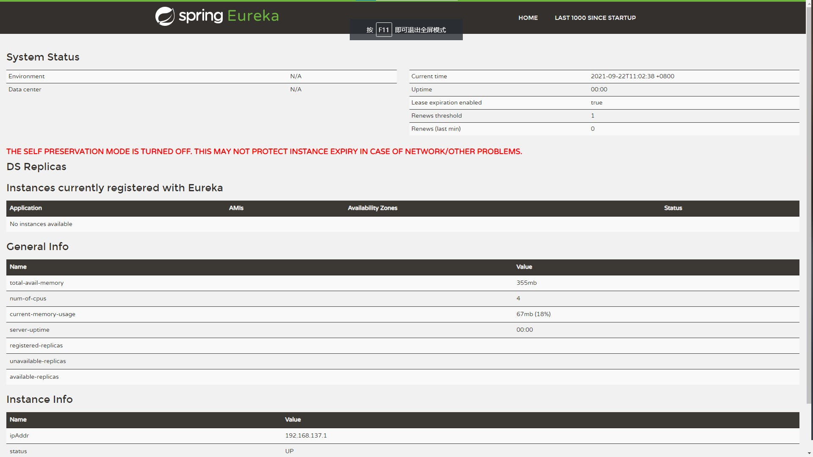
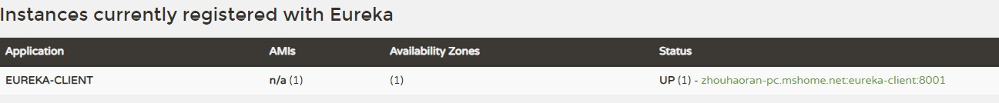
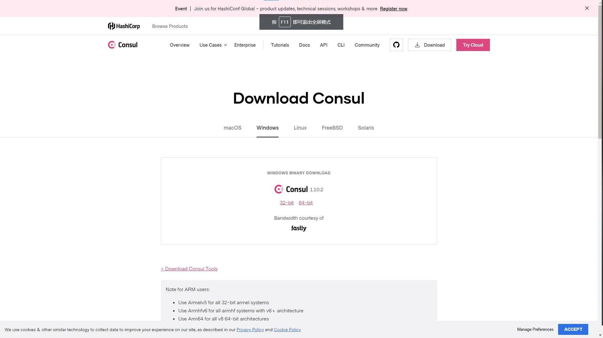
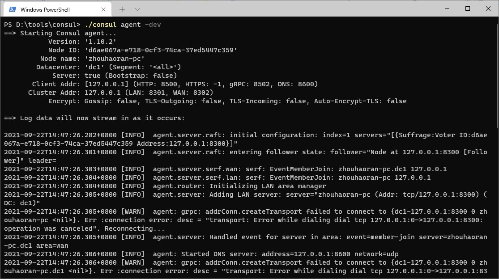
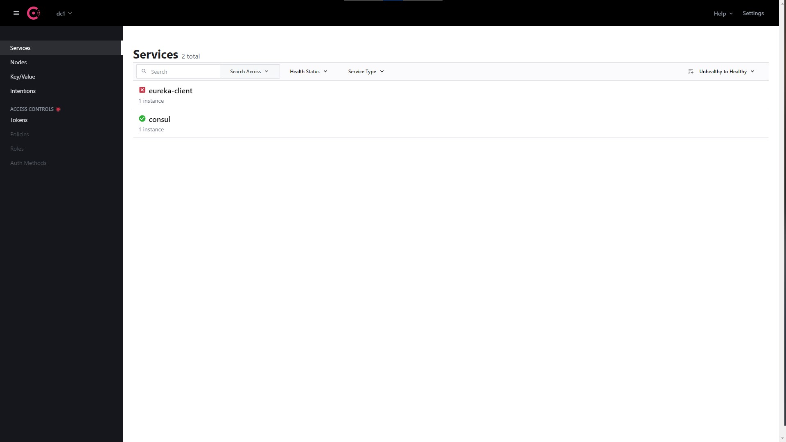

# 服务治理
SpringCloud为服务治理提供了一层抽象接口，所以在SpringCloud应用中可以支持多种不同的服务治理框架：```Netflix Eureka``` ```Consul``` ```Zookeeper```。在SpringCloud服务治理抽象层的作用下，可以无缝切换服务治理实现，而不影响服务注册、服务发现、服务调用等逻辑。

## SpringCloud Eureka
SpringCloud Eureka 是 SpringCloud Netflix项目下的服务治理模块，此子项目主要提供的模块：`服务发现（Eureka）` `断路器（Hystrix）` `智能路由（Zuul）` `负载均衡（Ribbon）`
  ### 服务注册中心
  创建SpringBoot项目，在pom.xml引入依赖<font color= red>（需要注意SpringCloud版本和Springboot版本对应）</font>
  ``` pox.xml
    <parent>
        <groupId>org.springframework.boot</groupId>
        <artifactId>spring-boot-starter-parent</artifactId>
        <version>2.5.4</version>
        <relativePath/> <!-- lookup parent from repository -->
    </parent>

    <dependencies>
        <dependency>
            <groupId>org.springframework.cloud</groupId>
            <artifactId>spring-cloud-starter-consul-discovery</artifactId>
        </dependency>
    </dependencies>
    <dependencyManagement>
        <dependencies>
            <dependency>
                <groupId>org.springframework.cloud</groupId>
                <artifactId>spring-cloud-dependencies</artifactId>
                <version>2020.0.3</version>
                <type>pom</type>
                <scope>import</scope>
            </dependency>
        </dependencies>
    </dependencyManagement>
  ```
通过`@EnableEurekaServer`注解启动一个服务注册中心
``` Java
    @EnableEurekaServer
    @SpringBootApplication
    public class EurekaServerApplication {

        public static void main(String[] args) {
            SpringApplication.run(EurekaServerApplication.class, args);
        }

    }
```
在默认配置下Eureka服务中心会将自己作为客户端进行注册，所以需要禁用它的客户端注册行为，在`application.yml`配置文件中进行配置
``` application.yml
server:
  port: 1001    //应用端口
spring:
  application:
    name: eureka-server

eureka:
  instance:
    hostname: localhost
  client:
    register-with-eureka: false
    fetch-registry: false
  server:
    enable-self-preservation: false //关闭自我保护
```
启动项目后，访问 <http://127.0.0.1:1001>,可以看到下面画面



### 创建服务提供者（Provider）
创建一个SpringBoot项目，也可以在上个服务中心项目中添加module,在`pom.xml`中添加以下依赖
``` pom.xml
    <parent>
        <groupId>org.springframework.boot</groupId>
        <artifactId>spring-boot-starter-parent</artifactId>
        <version>2.5.4</version>
        <relativePath/> <!-- lookup parent from repository -->
    </parent>
    <dependencies>
        <dependency>
            <groupId>org.springframework.boot</groupId>
            <artifactId>spring-boot-starter-web</artifactId>
        </dependency>
        <dependency>
            <groupId>org.springframework.cloud</groupId>
            <artifactId>spring-cloud-starter-netflix-eureka-client</artifactId>
        </dependency>
    </dependencies>
    <dependencyManagement>
        <dependencies>
            <dependency>
                <groupId>org.springframework.cloud</groupId>
                <artifactId>spring-cloud-dependencies</artifactId>
                <version>2020.0.3</version>
                <type>pom</type>
                <scope>import</scope>
            </dependency>
        </dependencies>
    </dependencyManagement>
```
创建Controller
``` Java
@RestController
public class DCController {
    @Autowired
    DiscoveryClient discoveryClient;    //SpringCloud提供的抽象借口，依赖此接口可以随意更换服务治理实现而不修改代码

    @GetMapping("/dc")
    public String dc(){
        String services = "Services: " + discoveryClient.getServices();
        System.out.println(services);
        return services;
    }
}
```
在应用主类上添加`@EnableEurekaClient`注解
``` Java
@EnableEurekaClient
@SpringBootApplication
public class EurekaClientApplication {

    public static void main(String[] args) {
        SpringApplication.run(EurekaClientApplication.class, args);
    }

}
```
做完这些后，还需要配置`application.yml`文件
``` application.yml
spring:
  application:
    name: eureka-client

server:
  port: 8001
eureka:
  client:
    service-url:
      defaultZone: http://127.0.0.1:1001/eureka/

```
启动该项目后，在此进入 <http://127.0.0.1:1001>，可以看到创建的服务成功进行了注册


### eureka的自我保护机制
> 当Eureka Server在短时间内丢失过多客户端时，将进入自我保护模式，进入该模式后，Eureka Server将不再删除服务注册表中的数据

* `expectedNumberOfRenewsPerMin` 期望最大每分钟续租次数
* `numberOfRenewsPerMinThreshold` 期望最小每分钟续租次数

当每分钟心跳书小于 `numberOfRenewsPerMinThreshold`(期望最小每分钟续租次数)时，将出发自我保护机制，不再自动过期续租

<div style="color:#33B5E5">
`expectedNumberOfRenewsPerMin` = 当前注册的应用实例数 x 2
`numberOfRenewsPerMinThreshold` = `expectedNumberOfRenewsPerMin` * 续租百分比( `eureka.renewalPercentThreshold` )
</div>

在eureka-server`初始化`、`定时重置`、`应用实例注册`、`应用实例下线`时重新计算`expectedNumberOfRenewsPerMin`，`numberOfRenewsPerMinThreshold`

定时重置由`eureka.renewalThresholdUpdateIntervalMs`配置，默认15分钟

## SpringCloud Consul
> Spring Cloud Consul 项目是针对 Consul 的服务治理实现。Consul 是一个分布式高可用的系统，它包含多个组件，但是作为一个整体，在微服务架构中，为我们的基础设施提供服务发现和服务配置的工具。

| Feature | Euerka | Consul |
| :--: | :--: | :--: |
| 服务健康检查 | 可配支持 | 服务状态，内存，硬盘等 |
| 多数据中心 | — | 支持 |
| kv 存储服务 | — |	支持 |
| 一致性 | — | raft |
| cap | ap | cp |
| 使用接口(多语言能力) | http（sidecar）| 支持 http 和 dns |
| watch支持 | 支持 long polling/大部分增量 | 全量/支持long polling |
| 自身监控 | metrics | metrics |
| 安全 | —	| acl/https |
| 编程语言 | Java |	go |
| Spring Cloud集成 |	已支持 | 已支持 |

### 安装Consul
在官网下载：[下载](https://www.consul.io/downloads)


解压后，得到`consul.exe`程序，在当前路径下打开命令行窗口
使用`consul agent -dev`启动consul



### 修改服务提供者（Provider）
在`pom.xml`添加依赖，并移除Eureka Client依赖
``` pom.xml
    <dependency>
        <groupId>org.springframework.cloud</groupId>
        <artifactId>spring-cloud-starter-consul-discovery</artifactId>
        <version>3.0.3</version>
    </dependency>
```
添加配置`application.yml`,不需要移除 eureka 的配置
``` application.yml
spring:
  application:
    name: eureka-client
  cloud:
    consul:
      host: localhost
      port: 8500
server:
  port: 8001
eureka:
  client:
    service-url:
      defaultZone: http://127.0.0.1:1001/eureka/
```
移除主类中`@EnableEurekaClient`注解即可，得益于SpringCloud对服务治理的抽象层，该项目已经完成转换Consul作为服务治理的实现。



***
## 附录
### 注册中心原理
在使用注册中心时，存在三种角色：服务提供者(provider)、服务消费者(consumer)、注册中心(registry)。
* provider在启动时，向register注册自己为一个服务，同时，定期向register发送心跳，保持存活。关闭时，向register取消注册
* consumer在启动时，向register订阅使用到的服务，并在内存中缓存服务的实例列表。后续，consumer向对应服务的provider发起调用时，从内存中该服务的实例列表中选取一个进行远程调用，关闭时取消订阅
* register在一定时间内没有收到provider的心跳，从服务的实例列表中移除provider。服务的实例列表发生变化时，通知订阅该服务的consumer刷新本地缓存。
eureka注册中心没有通知功能，而是让client定期轮询，以更新本地缓存