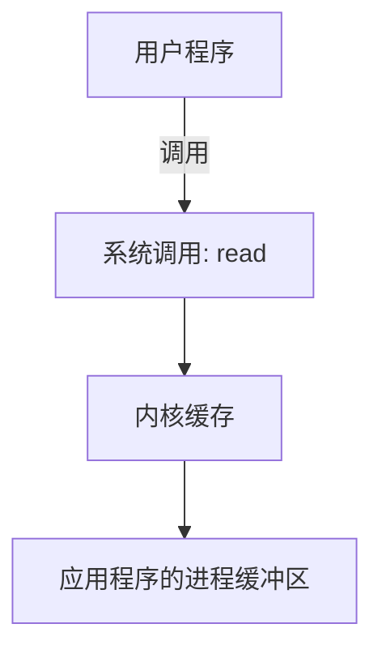
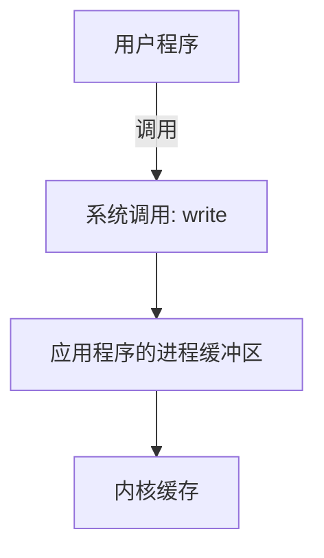

# IO
用户程序进行IO读写依赖read,write两个系统调用  
read系统调用:

write系统调用：  

aaa

***
<a style="color:red">应用程序的IO操作实际上并不是物理设备级别的读写，而是缓存的复制</a>

<kbd>read</kbd> ``&`` <kbd>write</kbd> 两个系统调用都不负责内核缓冲区和物理设备之间的交换
所有底层的读写操作，是由操作系统内核完成的

